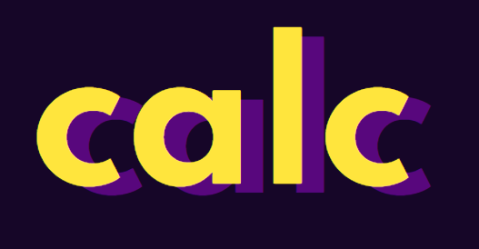
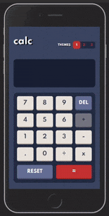
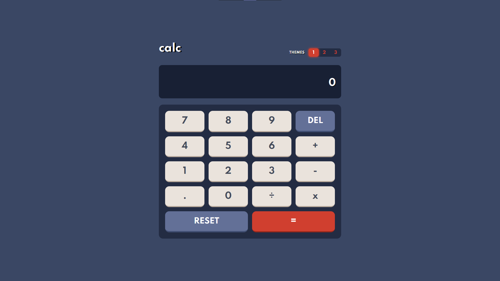
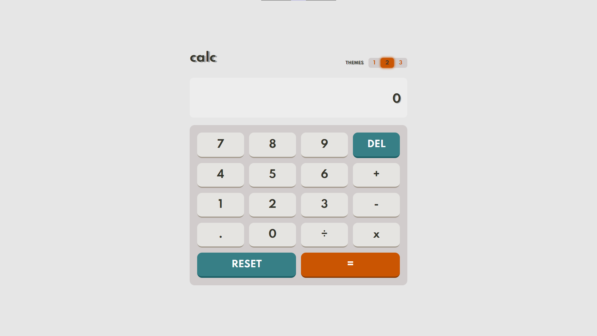
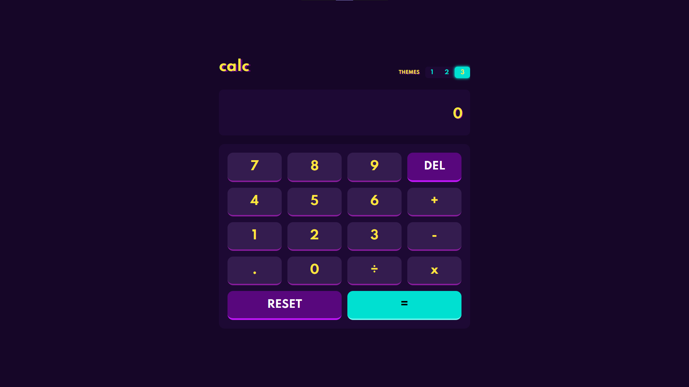

    

<h3 align="center"><a href="https://calculator-app-beige.vercel.app/">Site do app aqui</a></h3>

---

    <b>
        <a href="#sobre-">Sobre</a> •
        <a href="#tecnologias-%EF%B8%8F">Tecnologias</a> •
        <a href="#imagens-">Imagens</a> •
        <a href="#licença-%EF%B8%8F">Licença</a> •
        <a href="#autor-">Autor</a>
    </b>

  

    

## Sobre 🧮
**Uma aplicação feita para desenvoler uma calculadora com 3 temas distintos, podendo altera-los por um botão de switch.**

**Esse desafio foi apresentado pela [FrontendMentor](https://www.frontendmentor.io/challenges)**

---

## Tecnologias 🛠️
### Linguagens:
 - **HTML**
 - **[SASS](https://sass-lang.com/)**
 - **JavaScript**

      ### Funções:
      - [x] Switch de temas
      - [x] Smooth transitions
      - [x] Display do último número digitado

---

## Imagens 📸

    <h4>Exposição de cada tema:</h4>
    
    
    

---

## Licença ⚖️
#### *Esse projeto está sob a licença MIT. Para mais detalhes [LICENSE](https://github.com/gabrlcj/calculator-app/blob/056685e8de3d72fd5a91379b1e79dc994355151f/LICENSE).*

---

## Autor 🌌

<b>Gabriel Bittencourt Penteado 🔰</b>

#### Feito com 🤎 por Gabriel B. Penteado. Entre em contato! 👋🏽

 